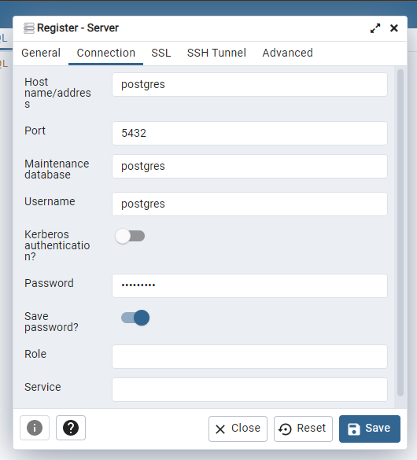
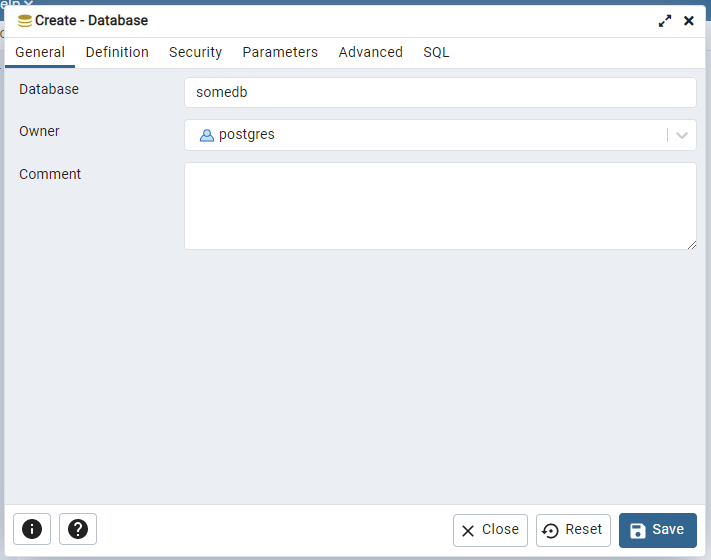
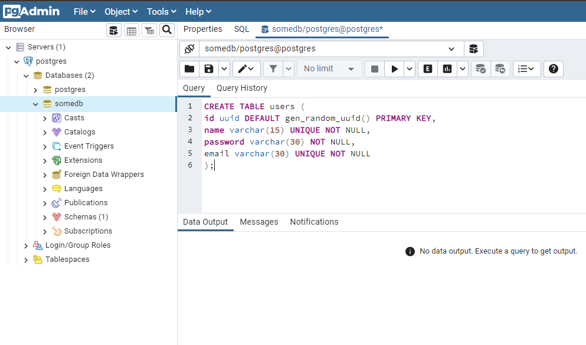

# NEST PLAIN PG

### Описание

Простой модуль для работы с postgres.  
Крайне простой пример работы с SQL без ORM

### Установка и запуск внутри Docker

* Скачайте репозиторий
* В файле `.env` установите следующие значения:

```env
SERVER_PORT = 8080
NODE_ENV = development
SERVER_HOST = nest
API_URL = localhost:8080/api/base-pg

POSTGRES_HOST = postgres
POSTGRES_PORT = 5432
POSTGRES_USER = postgres
POSTGRES_PASSWORD = 123456789
POSTGRES_DATABASE = somedb

PGADMIN_DEFAULT_EMAIL=admin@linuxhint.com
PGADMIN_DEFAULT_PASSWORD=secret
PGADMIN_LISTEN_PORT=28709
```

В файле `postgres.config.ts` установите следующие значения:

```ts
export const getPostgresConfig: IPgConfig = {
  user: 'postgres',
  host: 'postgres',
  database: 'somedb',
  password: '123456789',
  port: 5432,
};
```

В папке репозитория выполните команду в терминале `docker compose -f "docker-compose.yml" up -d --build`

После поднятия контейнеров откройте pgAdmin <http://localhost:28709/login?next=%2F/> и авторизуйтесь (данные учетной записи в файле .env)

```env
PGADMIN_DEFAULT_EMAIL=admin@linuxhint.com
PGADMIN_DEFAULT_PASSWORD=secret
```

Зарегистрируйте сервер и подключитесь к нему.
<p align="left">
    
</p>

Далее создайте базу данных c именем `somedb`.
<p align="left">
    
</p>

Далее создайте таблицу `users`.  
<p align="left">
    
</p>

Команда для создания таблицы приведена ниже.

```sql
CREATE TABLE users (
id uuid DEFAULT gen_random_uuid() PRIMARY KEY,
name varchar(15) UNIQUE NOT NULL,
password varchar(30) NOT NULL,
email varchar(30) UNIQUE NOT NULL
);
```

Готово!

### Документация

<http://localhost:8080/docs#/>

### Пример использования

Module

```ts
const dbProvider = {
  provide: PG_CONNECTION,
  useValue: new Pool(getPostgresConfig),
};

@Global()
@Module({
  providers: [dbProvider],
  exports: [dbProvider],
})
export class DbModule {}
```

Service

```ts
@Injectable()
export class BaseService {
  constructor(@Inject(PG_CONNECTION) private pg: any) {}

  async createUser(dto: CreateUserDto): Promise<ResUserDto> {
    const { rowCount, rows } = await this.pg.query(createUser(dto));
    if (rowCount === 0) {
      throw new BadRequestException(`Логин или имя уже заняты`);
    }
    return rows[0];
  }

  async updateUserById(id: string, dto: UpdateUserDto): Promise<ResUserDto> {
    const { rows } = await this.pg.query(checkUser, [dto.name, dto.email, id]);
    if (rows[0].count != 0) {
      throw new BadRequestException(`Логин или имя уже заняты`);
    }
    const updateUser = await this.pg.query(updateUserById, [
      id,
      dto.name,
      dto.password,
      dto.email,
    ]);
    return updateUser.rows[0];
  }
}
```

SQL

```ts
export const createUser = (dto: CreateUserDto) => `
INSERT INTO users (name, password, email)
 SELECT '${dto.name}', '${dto.password}', '${dto.email}'
 WHERE NOT EXISTS (
    SELECT null FROM users 
    WHERE (name) = ('${dto.name}') OR (email) = ('${dto.email}')
 ) RETURNING id, name, email;
`;
```

```ts
export const checkUser = `
 SELECT COUNT(*) FROM (
    SELECT * FROM users WHERE id <> $3
    ) as foo 
  WHERE name = $1 OR email = $2;
`;
```

```ts
export const updateUserById = `
UPDATE users SET 
    name = COALESCE($2, name),
    password = COALESCE($3, password),
    email = COALESCE($4, email)
WHERE id = $1 RETURNING id, name, email;
`;
```
